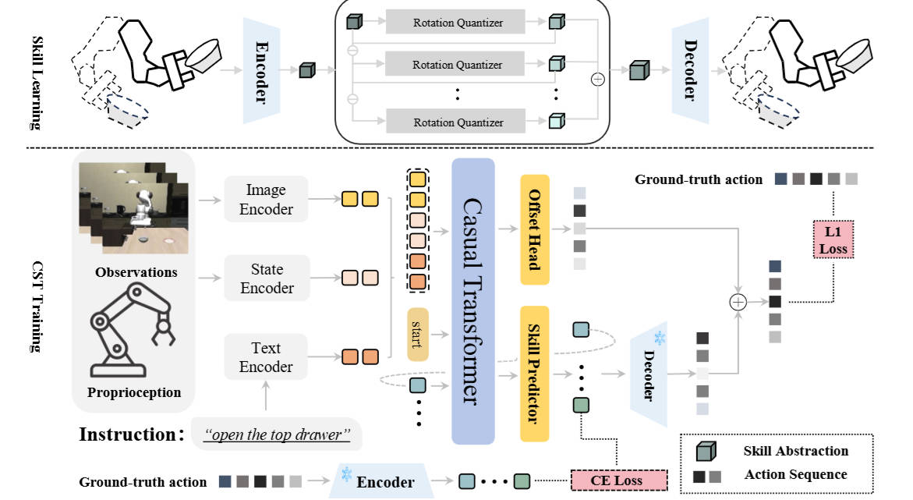

<div align="center">
<h2></sup>STAR: Learning Diverse Robot Skill Abstractions through Rotation-Augmented Vector Quantization</h2>

[**Hao Li**](https://openreview.net/profile?id=~Hao_Li59)<sup>1,2</sup> · [**Qi Lv**](https://aopolin-lv.github.io/)<sup>1,2</sup> · [**Rui Shao**]([https://rshaojimmy.github.io](https://rshaojimmy.github.io/OrionLab/)/)<sup>1&dagger;</sup> ·  [**Xiang Deng**](https://xiang-deng-dl.github.io/)<sup>1&dagger;</sup> · [**Yinchuan Li**](https://scholar.google.com/citations?user=Oo7c22wAAAAJ&hl=zh-CN)<sup>2</sup> · [**Jianye Hao**](https://scholar.google.com/citations?user=Oo7c22wAAAAJ&hl=zh-CN)<sup>2</sup> · [**Liqiang Nie**](https://liqiangnie.github.io/)<sup>1</sup>

<sup>1</sup>Harbin Institute of Technology (Shenzhen)&emsp;&emsp;&emsp;&emsp;<sup>2</sup>Huawei Noah's Ark Lab&emsp;&emsp;&emsp;&emsp;

<sup>&dagger;</sup>corresponding author

[](https://www.arxiv.org/abs/2506.03863)

</div>

## :fire: Updates
- [06/2025] [Arxiv paper](https://www.arxiv.org/abs/2506.03863) released.
- [05/2025] STAR has been accepted by ICML 2025 Spotlight!

## :fire: Introduction
This is the github repository of *STAR: Learning Diverse Robot Skill Abstractions through Rotation-Augmented Vector Quantization*. In this work, we presents STAR, a framework that advances both skill learning and composition to complete complex behaviors.

The whole framework of STAR:
<div align="center">

</div>

## :fire: Performance
Here we present the performance comparison between our method and baseline models on the LIBERO benchmark suite.

| Model | LIBERO-Object | LIBERO-Spatial | LIBERO-Goal | LIBERO-Long | LIBERO-90 | Avg. |
|-------|---------------|----------------|-------------|-------------|-----------|------|
| **VLAs** |
| Octo<sup>&dagger;</sup> | 85.7 ±0.9 | 78.9 ±1.0 | 84.6 ±0.9 | 51.1 ±1.3 | - | 75.1 ±0.6 |
| OpenVLA<sup>&dagger;</sup> | 88.4 ±0.8 | 84.7 ±0.9 | 79.2 ±1.0 | 53.7 ±1.3 | - | 76.5 ±0.6 |
| **Baselines** |
| ResNet-T | 78.9 ±1.4 | 75.7 ±1.9 | 52.7 ±2.4 | 45.0 ±1.1 | 83.9 ±1.5 | 67.3 ±0.9 |
| Diffusion Policy | 62.6 ±2.8 | 69.5 ±1.8 | 54.6 ±0.5 | 51.2 ±3.0 | 75.3 ±0.7 | 62.6 ±0.6 |
| ACT | 78.8 ±1.2 | 82.0 ±0.5 | 66.1 ±1.6 | 44.0 ±0.5 | 63.4 ±5.8 | 66.8 ±1.1 |
| **Skill-based Methods** |
| VQ-BeT | 90.3 ±1.5 | 88.7 ±2.0 | 61.3 ±1.0 | 59.7 ±0.2 | 84.2 ±0.3 | 76.8 ±0.5 |
| QueST | 90.0 ±1.1 | 84.5 ±0.2 | 76.7 ±0.9 | 69.1 ±1.0 | 87.4 ±0.4 | 81.5 ±0.6 |
| **Ours** | **98.3 ±0.2** | **95.5 ±0.6** | **95.0 ±0.7** | **88.5 ±0.3** | **90.8 ±0.2** | **93.6 ±0.1** |

## :fire: Details will be released. Stay tuned.

## :fire: Citation

If you find this work useful for your research, please kindly cite our paper:

```
@article{li2025star,
  title={STAR: Learning Diverse Robot Skill Abstractions through Rotation-Augmented Vector Quantization},
  author={Li, Hao and Lv, Qi and Shao, Rui and Deng, Xiang and Li, Yinchuan and Hao, Jianye and Nie, Liqiang},
  journal={arXiv preprint arXiv:2506.03863},
  year={2025}
}
```
